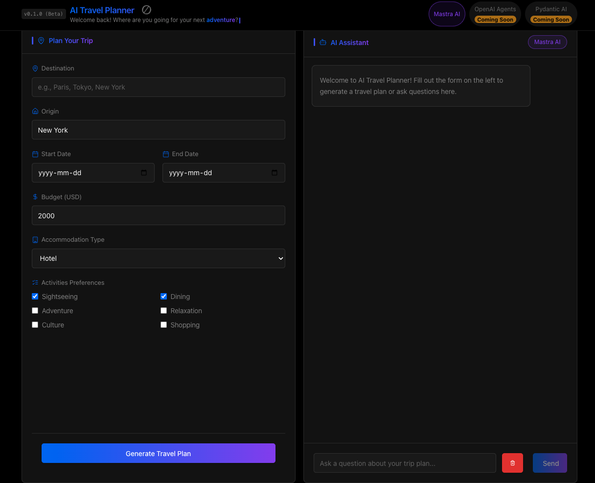

# AI Agent Framework Comparison - Travel Planner


This project aims to evaluate three AI agent frameworks for a travel planning system:

1. **Pydantic AI** (Python)
2. **OpenAI Agents SDK** (Python)
3. **Mastra AI** (TypeScript)

The application consists of a React frontend and three separate backend implementations, each using a different AI agent framework.

## Project Structure

```
/
├── frontend/               # React frontend
├── backend/
│   ├── pydantic-ai/        # Python backend using Pydantic AI
│   ├── openai-agents-py/   # Python backend using OpenAI Agents SDK
│   └── mastra-ai/          # TypeScript backend using Mastra AI
```

## Setup Instructions

### Running with Docker (Recommended)

The easiest way to run the application is using Docker and Docker Compose.

#### Prerequisites

- Docker and Docker Compose installed
- OpenAI API key

#### Setup

1. Create an `.env` file with your OpenAI API key:

   ```bash
   cp .env-example .env
   # Edit the .env file to add your OpenAI API key
   ```

2. Build and start the containers using Make:

   ```bash
   make build
   make up
   ```

   Or directly with Docker Compose:

   ```bash
   docker-compose build
   docker-compose up -d
   ```

3. Access the application:
   - Frontend: http://localhost:8080
   - Backend API: http://localhost:3000

#### Available Make Commands

```bash
make build     # Build all containers
make up        # Start all containers in detached mode
make up-logs   # Start containers with attached logs
make down      # Stop and remove all containers
make restart   # Restart all containers
make logs      # View logs from all containers
make ps        # List all running containers
make clean     # Remove all containers, volumes, and images
```

### Running Without Docker

#### Prerequisites

- Node.js 20 or higher (recommended to use NVM)
- Python 3.9 or higher
- Poetry (for Python dependency management)

#### Node.js Setup (using NVM)

If you have NVM installed, you can simply run:

```bash
# Use the correct Node.js version
nvm use
```

If you don't have NVM installed, follow the [NVM installation instructions](https://github.com/nvm-sh/nvm#installing-and-updating).

#### Frontend Setup

```bash
cd frontend
npm install
npm start
```

The frontend will run on http://localhost:3000

#### Backend Setup

##### Pydantic AI (Python)

```bash
cd backend/pydantic-ai
poetry install
poetry run python server.py
```

The Pydantic AI backend will run on http://localhost:8000

##### OpenAI Agents SDK (Python)

```bash
cd backend/openai-agents-py
poetry install
poetry run python server.py
```

The OpenAI Agents SDK backend will run on http://localhost:8001

##### Mastra AI (TypeScript)

```bash
cd backend/mastra-ai
npm install
npm run dev
```

The Mastra AI backend will run on http://localhost:3000

## Environment Variables

Create a `.env` file in each backend directory with the appropriate API keys:

```
# For OpenAI-based backends
OPENAI_API_KEY=your_openai_key_here
```

## Architecture Details

For detailed architecture information about each implementation, see the respective READMEs:

- [Mastra AI Architecture](backend/mastra-ai/README.md)
- Pydantic AI Architecture (TODO)
- OpenAI Agents Architecture (TODO)

## User Interface



The frontend provides an intuitive interface for planning travel with AI:

- **Framework Selection**: Choose between different AI agent frameworks (currently using Mastra AI)
- **Travel Form**: Input destination, dates, budget, and preferences
- **AI Chat Interface**: Interact with the AI to refine your travel plans
- **Interactive Itinerary Display**: View and modify generated travel plans
- **Responsive Design**: Works on desktop and mobile devices

## System Overview

The system consists of four main agents:

1. **Coordinator Agent** - Analyzes user requirements, delegates tasks, and synthesizes final itinerary
2. **Flight Research Agent** - Finds optimal flight options based on user constraints
3. **Accommodation Agent** - Researches hotels, Airbnbs, and other lodging options
4. **Activities Agent** - Discovers popular attractions, restaurants, and experiences

## Agent Features

The travel planning agents provide the following functionality:

- Trip planning based on destination, dates, budget, and preferences
- Flight suggestions and bookings
- Accommodation recommendations
- Activity and attraction suggestions
- Weather-aware planning
- Budget optimization
- Interactive follow-up question answering

## Evaluation Criteria

- Code complexity and maintainability
- Development time
- Performance
- Features supported
- Ease of deployment

## Development

### Requirements

- Node.js 20 or higher (for JavaScript/TypeScript code)
- Python 3.9 or higher (for Python code)
- Poetry (Python dependency management)

This project uses an `.nvmrc` file to specify the Node.js version. If you use NVM, simply run `nvm use` in the project root.

### Code Quality

This project uses ESLint and Prettier for JavaScript/TypeScript code quality, and Black, isort, and flake8 for Python code quality. See [LINTING.md](LINTING.md) for details.

- Run `npm run lint` to check for linting issues
- Run `npm run format` to format all files

### Continuous Integration

GitHub Actions workflows are set up for:

- **Linting and Formatting**: Ensures code quality
- **Testing**: Runs unit tests for all components
- **Building**: Builds the frontend and backend applications
- **Semantic Release**: Automates versioning and changelog generation based on commit messages

### Contributing

1. Fork the repository
2. Create a feature branch (`git checkout -b feature/amazing-feature`)
3. Commit your changes using conventional commits (`feat: add amazing feature`)
4. Push to the branch (`git push origin feature/amazing-feature`)
5. Open a Pull Request
