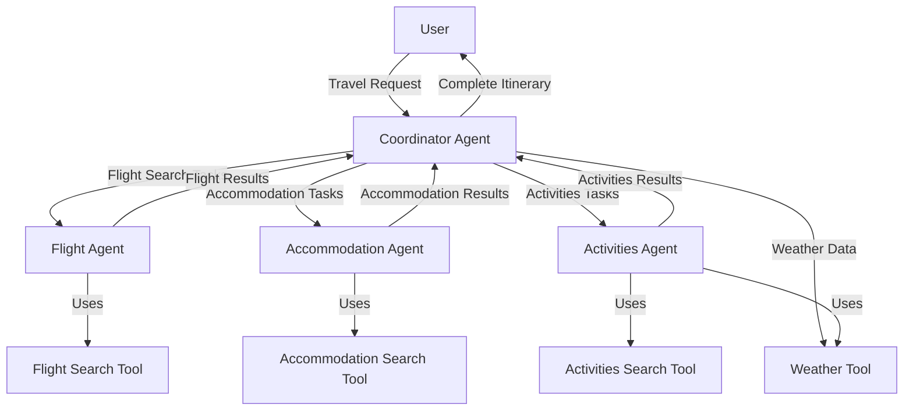
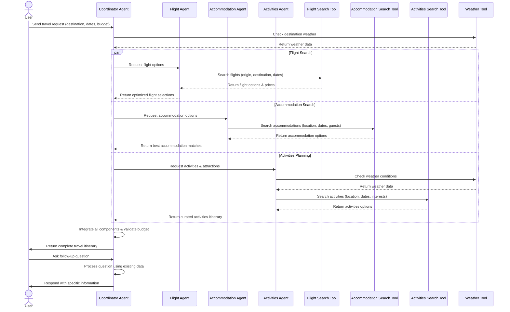

# Mastra AI - Travel Planning Agent

This project demonstrates a multi-agent travel planning system built with Mastra. The system uses a coordinator agent that orchestrates specialized agents for flight search, accommodation booking, and activity planning.

## Architecture

### Component Flow

### Sequence Diagram

## Agent Roles

### Coordinator Agent
- Main orchestration agent
- Delegates tasks to specialized agents
- Synthesizes final travel itinerary
- Ensures budget constraints are met
- Answers user follow-up questions

### Flight Agent
- Specialized in finding optimal flights
- Considers price, layovers, flight duration, airline quality
- Makes recommendations based on user preferences

### Accommodation Agent
- Finds ideal lodging options
- Considers location, amenities, ratings, value for money
- Specializes in hotel and accommodation recommendations

### Activities Agent
- Discovers popular attractions and experiences
- Creates daily itineraries with logical organization
- Balances must-see attractions with unique experiences
- Considers weather conditions for appropriate planning

## Tools

### Flight Search Tool
- Finds flight options based on origin, destination, and dates
- Returns flight details including prices, times, and airline information

### Accommodation Search Tool
- Searches for accommodation options based on location and requirements
- Returns details about hotels, apartments, and other lodging options

### Activities Search Tool
- Finds activities, attractions, and experiences at a destination
- Creates recommended daily itineraries

### Weather Tool
- Gets current weather for a location
- Helps plan weather-appropriate activities

## Usage

The Mastra AI system provides a conversational interface where users can describe their travel plans and receive comprehensive itineraries. The system can handle:

- Initial travel planning with minimal information
- Follow-up questions about specific aspects of the trip
- Budget constraints and preference adjustments
- Weather-aware activity recommendations

The output is a structured JSON itinerary containing all travel details along with a natural language summary.